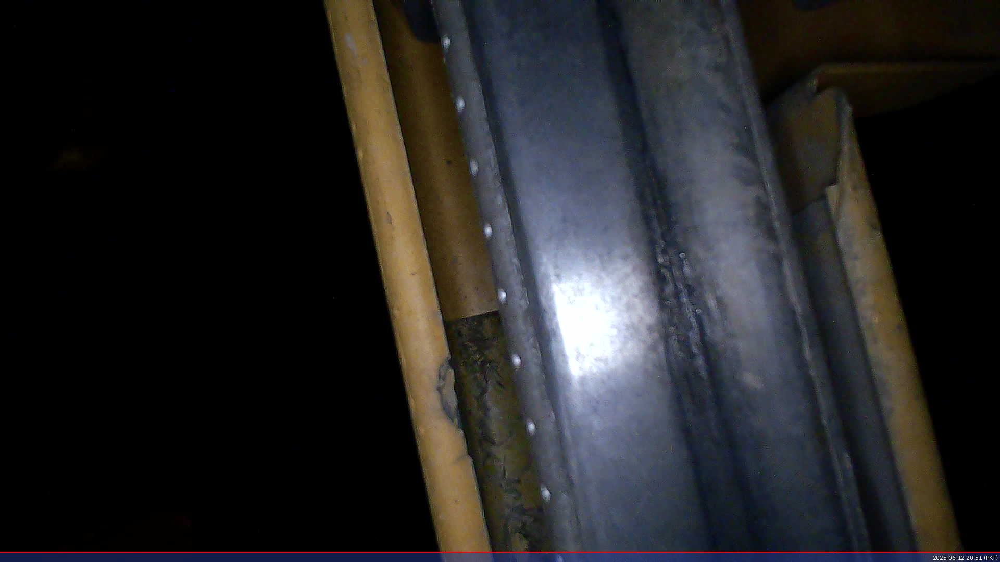
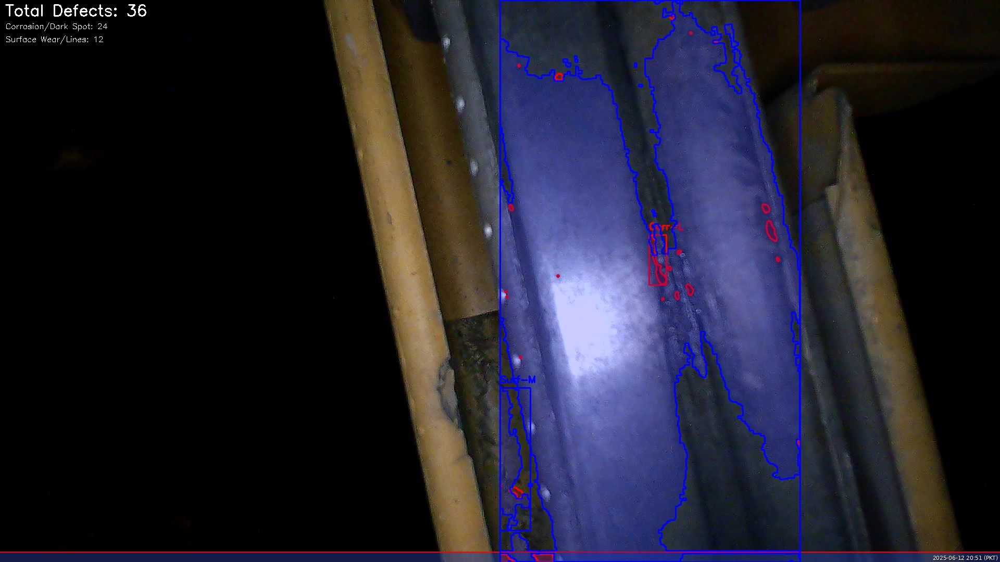

# 🚇 Third Rail Defect Detection System (TRDDS)


A comprehensive system for detecting defects in metro third rails using both **image processing** and **real-time webcam analysis**. The system identifies:
- Corrosion/Dark spots
- Surface wear patterns
- Cracks/Linear defects
- LED glare interference

## 🌟 Key Features

### 📷 Dual Operation Modes
1. **Batch Image Processing** (`TRD_training.py`)
   - Process folders of rail images
   - Generate detailed defect reports
   - Create before/after comparisons

2. **Live Webcam Analysis** (`TRD_video.py`)
   - Real-time defect detection
   - Interactive controls:
     - 📹 Record 20-second videos
     - 📸 Capture still images
     - ↔️ Side-by-side comparison view
   - Optimized for Raspberry Pi 5

### 🔍 Advanced Detection Capabilities
- **Multi-stage defect classification** by type and severity
- **LED glare removal** for clearer analysis
- **Adaptive thresholds** for varying lighting conditions
- **Configurable sensitivity** through easy-to-edit macros

## 🛠️ Installation & Setup

### Prerequisites
- Python 3.8+
- OpenCV 4.5+
- Raspberry Pi 5 (for live mode) or any modern PC

```bash
# Clone repository
git clone https://github.com/meds-uet/third-rail-maintenance.git
cd third-rail-defect-detection

# Install dependencies
pip3 install opencv-python numpy
```

## 🚀 Usage

### Batch Processing Mode
1. Place your rail images in `/images` folder
2. Run:
   ```bash
   python3 TRD_training.py
   ```
3. Results saved in:
   - `/output/processed` - Annotated images
   - `/output/comparisons` - Before/after comparisons

### Live Webcam Mode
1. Connect your webcam
2. Run:
   ```bash
   python3 TRD_video.py
   ```
3. Use the interactive controls:
   - **RECORD** button: Capture 20-second video
   - **CAPTURE** button: Save still image
   - **EXIT** button: Quit application
   - *Keyboard shortcuts*: R=Record, C=Capture, Q=Quit

4. Outputs saved in:
   - `/output/live_captures` - Still images
   - `/output/live_recordings` - Video clips

## 📂 Folder Structure
```
project-root/
├── images/                  # Input images for batch processing
├── output/
│   ├── processed/           # Processed images with defects marked
│   ├── comparisons/         # Side-by-side before/after comparisons
│   ├── live_captures/       # Webcam still images
│   └── live_recordings/     # Recorded video clips
├── assets/                  # Documentation assets
├── TRD_training.py          # Batch image processing 
└── TRD_video.py             # Live webcam processing script
```

## ⚙️ Configuration Guide
Key parameters in the code (all adjustable at top of files):

```python
# === CONFIGURABLE MACROS ===
# ROI Configuration
ROI_START_PERCENT = 0.50          # % of image width to extract for rail ROI
ROI_WIDTH_PERCENT = 0.30          # % of image width to extract for rail ROI

# LED Light Removal Configuration
LED_LIGHT_THRESHOLD = 400         # LED detection brightness threshold
LED_KERNEL_SIZE = 80              # Size of morphological structuring element
LED_MIN_AREA = 200                # Minimum area to trigger inpainting
INPAINT_RADIUS = 20               # Radius for inpainting blur

# Defect Detection Thresholds
CORROSION_THRESHOLD = 50          # Dark spot threshold
CRACK_THRESHOLD = 5               # Crack detection threshold
MIN_DEFECT_AREA = 2               # Ignore small defects below this area
MAX_DEFECT_AREA = 1000            # Ignore overly large blobs
MIN_CRACK_LENGTH = 1              # Minimum length to be considered a crack
ROUGHNESS_INTENSITY_THRESHOLD = 10 # For surface wear / rough track

# Image Processing Parameters
BILATERAL_FILTER_D = 9            # Diameter for bilateral filter
BILATERAL_FILTER_SIGMA_COLOR = 80 # Sigma color for bilateral filter
BILATERAL_FILTER_SIGMA_SPACE = 80 # Sigma space for bilateral filter
GAUSSIAN_BLUR_KERNEL = (3, 3)     # Kernel size for Gaussian blur
ADAPTIVE_THRESH_BLOCK_SIZE = 21   # Block size for adaptive threshold
ADAPTIVE_THRESH_C = 10            # Constant for adaptive threshold
MORPH_KERNEL_SIZE = (5, 5)        # Size for morphological operations
LINE_DETECTION_KERNEL_SIZE = 15   # Size for line detection kernels
CANNY_THRESHOLD1 = 30             # Canny edge detection threshold 1
CANNY_THRESHOLD2 = 100            # Canny edge detection threshold 2
CANNY_APERTURE_SIZE = 3           # Canny aperture size
HOUGH_THRESHOLD = 30              # Threshold for Hough line detection
HOUGH_MIN_LINE_LENGTH = 1         # Minimum line length for Hough
HOUGH_MAX_LINE_GAP = 10           # Maximum line gap for Hough

# Defect Classification Thresholds
CORROSION_SEVERE_AREA = 2000      # Area threshold for severe corrosion
CORROSION_MEDIUM_AREA = 800       # Area threshold for medium corrosion
WEAR_SEVERE_AREA = 1500           # Area threshold for severe wear
CRACK_SEVERE_LENGTH = 100         # Length threshold for severe cracks
DEFECT_LABEL_AREA = 500           # Minimum area to show defect label

# Visualization Parameters
ROI_BOUNDARY_COLOR = (255, 255, 0) # Color for ROI boundary (BGR)
DEFECT_COLORS = {
    'Corrosion/Dark Spot': (0, 0, 255),    # Red
    'Surface Wear/Lines': (255, 0, 0),     # Blue
    'Crack/Linear Defect': (0, 255, 0)     # Green
}
DEFECT_LABEL_FONT = cv2.FONT_HERSHEY_SIMPLEX
DEFECT_LABEL_FONT_SCALE = 0.6      # Increased font size
DEFECT_LABEL_THICKNESS = 2         # Increased thickness
SUMMARY_FONT_SCALE = 1.0           # Increased summary font size
SUMMARY_FONT_THICKNESS = 2

# Live Processing Parameters
LIVE_FRAME_WIDTH = 640             # Reduced for RPi performance
LIVE_FRAME_HEIGHT = 480
LIVE_FPS = 15                      # Reduced FPS for RPi
RECORDING_DURATION = 20            # seconds
VIDEO_FPS = 15                     # frames per second for recording
OUTPUT_VIDEO_CODEC = 'XVID'        # Codec for video recording
BUTTON_COLOR = (0, 255, 0)         # Green color for active buttons
BUTTON_INACTIVE_COLOR = (50, 50, 50) # Gray color for inactive buttons
```

## 📊 Sample Outputs

### Batch Processing Example
| Original Image | Processed Result |
|----------------|------------------|
|  |  |


## 🧩 Technical Approach
1. **ROI Extraction**: Focuses analysis on the critical rail surface area
2. **LED Glare Removal**: Uses adaptive thresholding and inpainting
3. **Multi-Method Detection**:
   - Corrosion: Adaptive thresholding + contour analysis
   - Cracks: Canny edge detection + Hough line transform
   - Wear: Morphological operations + texture analysis
4. **Classification**: Defects categorized by type and severity

## 📈 Performance Metrics
| Mode          | Resolution | FPS (RPi 5) | FPS (PC) |
|---------------|-----------|------------|----------|
| Batch         | Original  | N/A        | ~3-5/img |
| Live          | 640x480   | 10-15      | 25-30    |

## 🤝 Contributing
1. Fork the repository
2. Create your feature branch (`git checkout -b feature/improvement`)
3. Commit your changes (`git commit -m 'Add some feature'`)
4. Push to the branch (`git push origin feature/improvement`)
5. Open a Pull Request

## 📜 License
MIT License - See [LICENSE](LICENSE) for details

## ✉️ Contact
**Umer Shahid**  
Department of Electrical Engineering  
University of Engineering & Technology (UET), Lahore  
📧 umershahid@uet.edu.pk