# ⚡️ Sparking Spot Detection on METRO 3rd Rail - Image Processing Demo

This repository demonstrates a prototype solution for **detecting sparking spots or burn marks** on METRO Train third-rail tracks using image processing techniques. These marks typically indicate points of concern for maintenance due to electrical arcing or physical wear.

---

## 🧠 Objectives

- Automatically detect and highlight **irregular dark burn marks or spots** on rail surfaces.
- Compare two different detection algorithms:
  - **Algorithm 1** – OpenCV Contour-based Filtering
  - **Algorithm 2** – Blob Detection (Optimized for spot-like patterns)

---

## 🔍 Sample Comparisons

Below are some visual comparisons of original images vs. results of both detection algorithms.

> 📁 Folder Structure:
> - `samples/` – Raw input images
> - `cv_output/` – Results from OpenCV contour-based detection
> - `blob_output/` – Results from blob detection

---

### ✅ Example 1 – `Img_001.jpeg`

| Original (`samples/`) | Algorithm 1 – OpenCV (`cv_output/`) | Algorithm 2 – Blob Detection (`blob_output/`) |
|-----------------------|-------------------------------------|-----------------------------------------------|
| 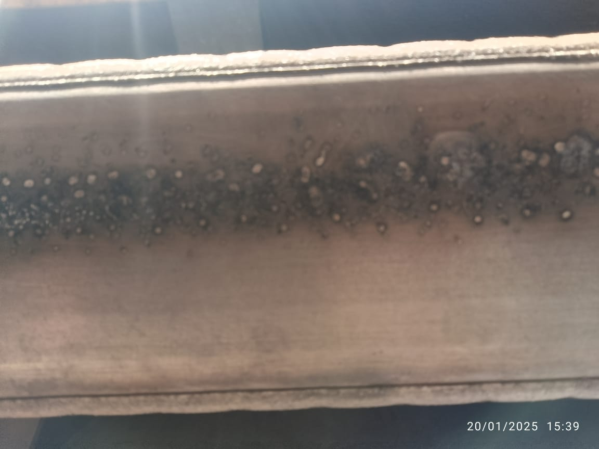 | 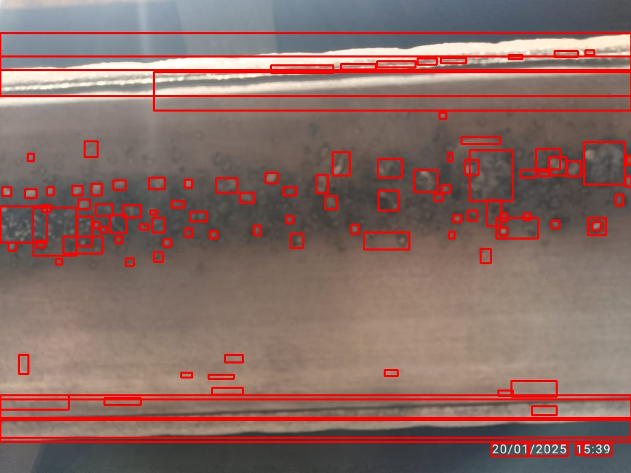 | 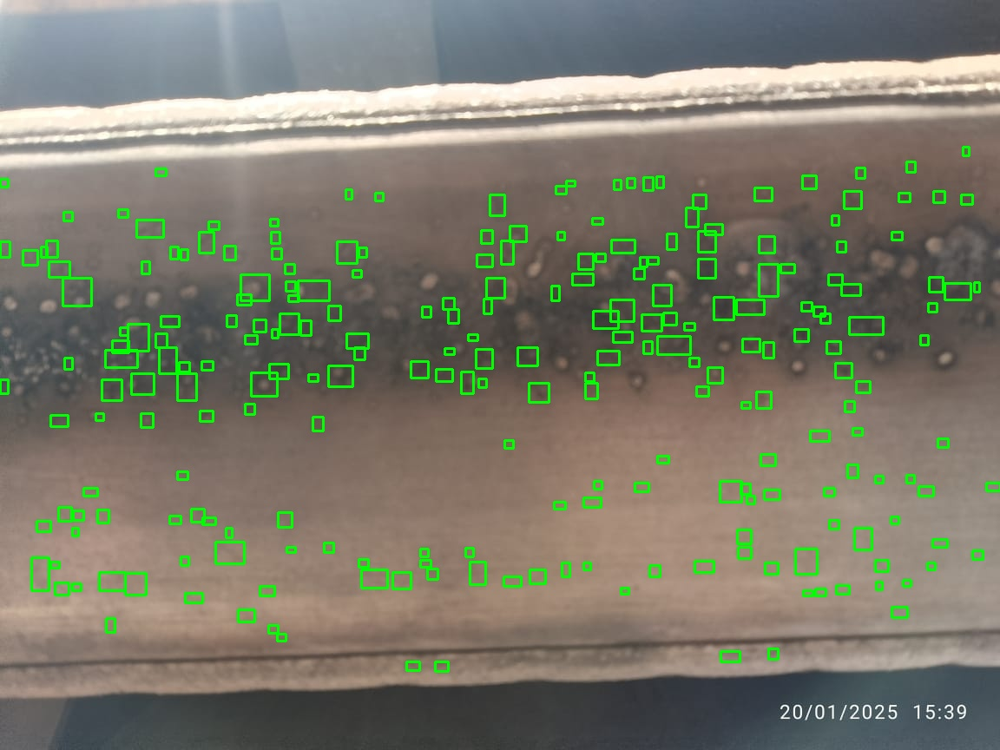 |

---

### ✅ Example 2 – `Img_002.jpeg`

| Original (`samples/`) | Algorithm 1 – OpenCV (`cv_output/`) | Algorithm 2 – Blob Detection (`blob_output/`) |
|-----------------------|-------------------------------------|-----------------------------------------------|
| 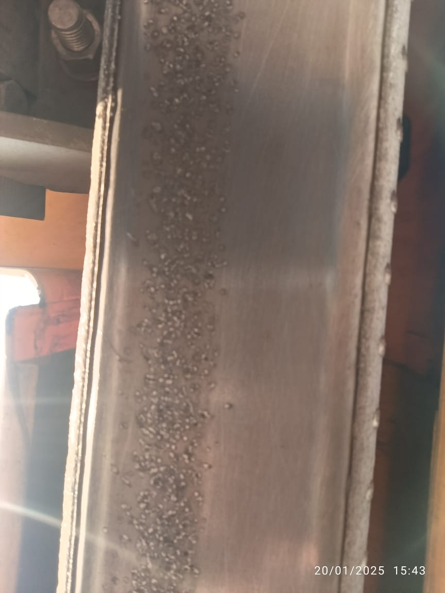 | 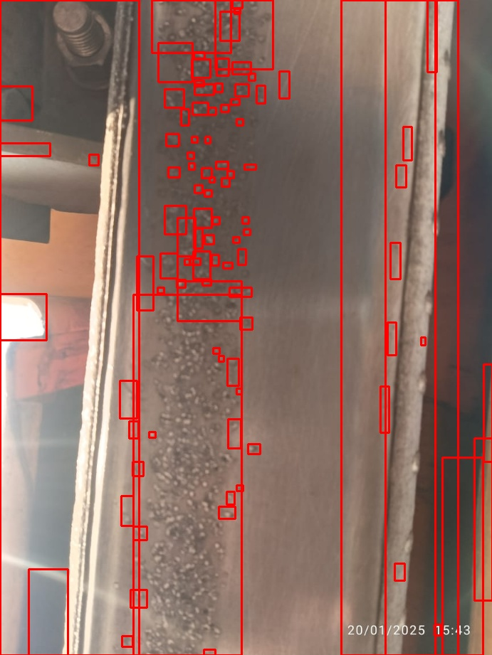 | 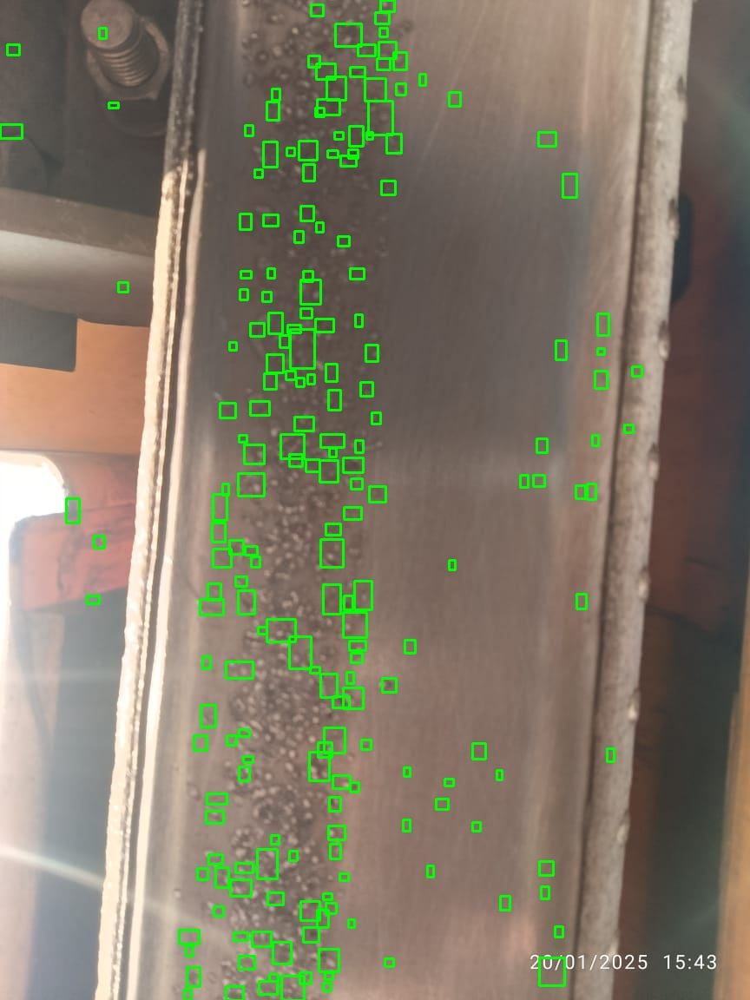 |

---

### ✅ Example 3 – `Img_003.jpeg`

| Original (`samples/`) | Algorithm 1 – OpenCV (`cv_output/`) | Algorithm 2 – Blob Detection (`blob_output/`) |
|-----------------------|-------------------------------------|-----------------------------------------------|
| 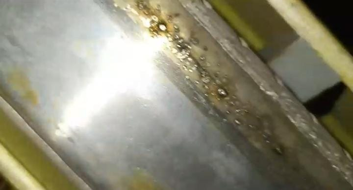 |  | 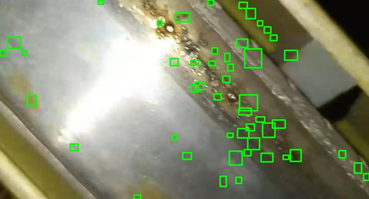 |

---

### ✅ Example 4 – `Img_004.jpeg`

| Original (`samples/`) | Algorithm 1 – OpenCV (`cv_output/`) | Algorithm 2 – Blob Detection (`blob_output/`) |
|-----------------------|-------------------------------------|-----------------------------------------------|
| 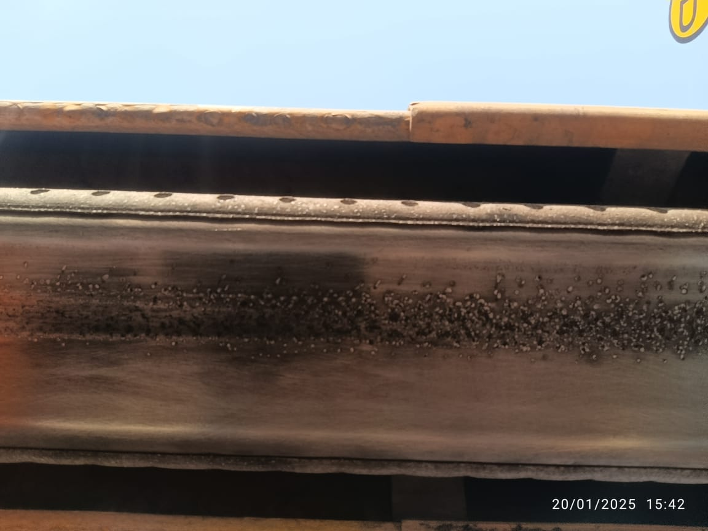 | 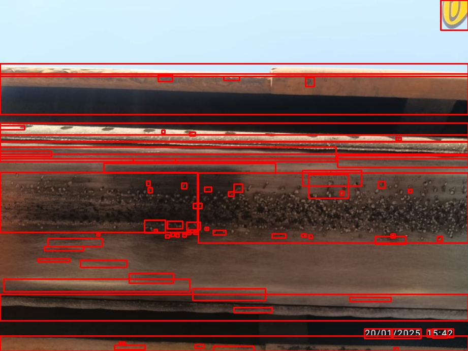 | 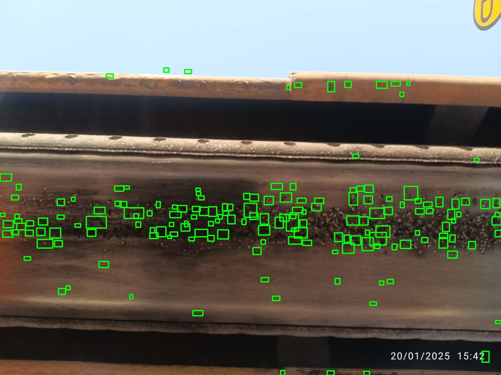 |

---

## ⚙️ Implementation Details

### 🔧 Algorithm 1: OpenCV Contour-Based Detection
- Preprocessing using grayscale + histogram equalization
- Adaptive thresholding to detect dark patches
- Morphological filtering to remove noise
- Contour detection and size filtering
- Good at: Detecting defined, mid-size marks
- Weakness: May confuse rail edges or shadows as marks

### 🎯 Algorithm 2: Blob Detection
- Uses `cv2.SimpleBlobDetector`
- Filters based on area, circularity, and color
- Good at: Isolating circular, spot-like features
- Weakness: May miss irregular shaped burn areas

---

## 📌 Next Steps & Recommendations

- Improve accuracy using a hybrid approach or lightweight ML classifier (SVM or YOLOv5)
- Train on more labeled samples to eliminate false positives
- Integrate with a video pipeline for real-time inspection

---

## 👨‍💻 Maintainer

This project was developed as a technical proof-of-concept for the METRO Train Management team by:

**Umer Shahid (Lecturer)**  
Department of Electrical Engineering  
University of Engineering & Technology (UET), Lahore  
📧 umershahid@uet.edu.pk  

---

## 📎 License

This demo is shared for evaluation purposes and is not licensed for commercial deployment without prior approval.

